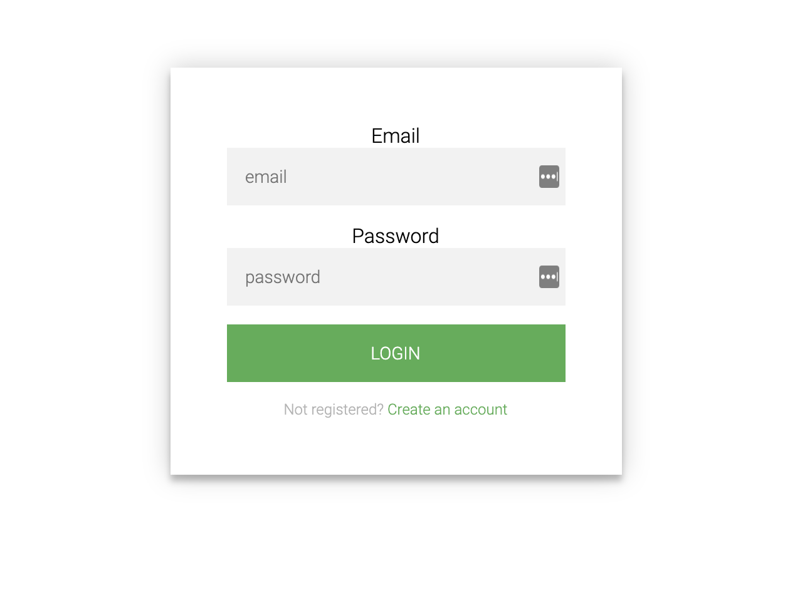

## Call Loved Ones:

Ever forget to call someone who you meant to call ? It has to all of us. Use this application to make a list of people you want to catch up with and check on. I think they'll appreciate it ;) Don't forget mom!

## Technologies Used:
HTML

ejs

javascript

nodejs

css

mongoDB

express

## Installation

1. Clone repo
2. run `npm install`

## Usage

1. run `node server.js`
2. Navigate to `localhost:8080`

